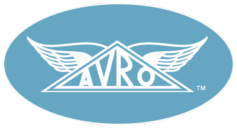
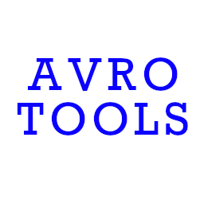

<!--

 Licensed to the Apache Software Foundation (ASF) under one
 or more contributor license agreements.  See the NOTICE file
 distributed with this work for additional information
 regarding copyright ownership.  The ASF licenses this file
 to you under the Apache License, Version 2.0 (the
 "License"); you may not use this file except in compliance
 with the License.  You may obtain a copy of the License at

   https://www.apache.org/licenses/LICENSE-2.0

 Unless required by applicable law or agreed to in writing,
 software distributed under the License is distributed on an
 "AS IS" BASIS, WITHOUT WARRANTIES OR CONDITIONS OF ANY
 KIND, either express or implied.  See the License for the
 specific language governing permissions and limitations
 under the License.

-->

## Overview

When editing an Avro schema, everyone has a preferred editor. Some use an IDE, like IntelliJ, Pycharm, RustRover or
Visual Studio, while others prefer a more humble text editor like Pulsar, Emacs or Vim.

Most provide help when working with Avro via JSON support (for JSON schemata) by offering syntax highlighting and
formatting. Some provide more help, for example syntax highlighting for IDL schemata, code completion, error
highlighting and more.

The IDEs and editors that we know to support Avro better than just editing schemata as JSON files are listed below in
alphabetical order.

## Eclipse

Eclipse is a free IDE that provides extensions via the [Eclipse Marketplace](https://marketplace.eclipse.org/).

### Avroclipse

[Extension](https://marketplace.eclipse.org/content/avroclipse) ([source](https://github.com/dvdkruk/avroclipse))

Released in 2015, this plugin received its last update in December 2019.

Features for IDL files:

* Syntax Highlighting
* Code Completion
* Error Highlighting

## Emacs

Sometimes ridiculed as an operating system, Emacs is a rich text editor. Many packages are available
via one of the three main package archives: [GNU ELPA](https://elpa.gnu.org/), [non-GNU ELPA](https://elpa.nongnu.org/)
or [MELPA](https://melpa.org/).

### emacs-avro

[Package source](https://github.com/logc/emacs-avro)

Originally released elsewhere in 2013, the last update was in March 2021.

This package is not available via the main package archives.

Provides syntax highlighting for IDL schemata.

## JetBrains IDE family

JetBrains features an entire line of IDEs. They include IntelliJ IDEA, PyCharm, PhpStorm, GoLand, Rider, CLion,
RustRover, WebStorm, RubyMine,
DataGrip, DataSpell, ReSharper, Fleet, and Aqua.

All of them use the [Plugin Marketplace](https://plugins.jetbrains.com/) to load extensions from.

### Apache Avro IDL Schema Support

[Plugin](https://plugins.jetbrains.com/plugin/15728-apache-avro-idl-schema-support) ([source](https://github.com/opwvhk/avro-schema-support?tab=readme-ov-file#intellij-plugin-for-apache-avro-idl))

Released in 2021, this plugin received its last update in April 2025.

Features for Avro schema & protocol definitions:

* Syntax Highlighting
* Code Completion
* Code Formatting
* Error Highlighting
* Inspections & quick fixes (IDL only)
* New file templates

The plugin supports all JetBrains products.

### Avro and Parquet Viewer

[Plugin](https://plugins.jetbrains.com/plugin/12281-avro-and-parquet-viewer) ([source](https://github.com/benwatson528/intellij-avro-parquet-plugin))]

Released in 2021, this plugin received its last update in November 2022.

Allows previewing `.avro` files, and shows its schema in an editor tab.

### Big Data File Viewer

[Plugin](https://plugins.jetbrains.com/plugin/21701-big-data-file-viewer) (
part of the [Big Data Tools](https://plugins.jetbrains.com/bundles/8-big-data-tools))

Released in 2023, this plugin is actively developed by JetBrains.

Allows previewing `.avro` files, and shows its schema in the structure tool window.

## Pulsar

A Chromium-based text editor, Pulsar touts itself as community-led and hyper-hackable. Extensions can be found in
its [Package Repository](https://web.pulsar-edit.dev/).

### atom-language-avro

[Package](https://web.pulsar-edit.dev/packages/atom-language-avro) ([source](https://github.com/jonesetc/atom-language-avro))

Released in 2015, this package provides syntax highlighting for IDL schemata.

## Vim

### vim-avro

[Plugin source](https://github.com/gurpreetatwal/vim-avro?tab=readme-ov-file#vim-avro)

Released in December 2016, this plugin has received no updates since.

Features syntax highlighting for IDL schemata,

### avro-idl.vim

[Plugin source](https://github.com/apache/avro/blob/main/share/editors/avro-idl.vim)

Featured in the Avro repository `share/editors` directory. Introduced in 2010, this plugin received its last update in
June 2019.

Features syntax highlighting for IDL schemata,

## Visual Studio Code:

Being a Microsoft product, Visual Studio Code provides extensions via
a [Plugin Marketplace](https://marketplace.visualstudio.com/).

### avro-idl

[Plugin](https://marketplace.visualstudio.com/items?itemName=streetsidesoftware.avro) ([source](https://github.com/streetsidesoftware/vscode-avro-ext?tab=readme-ov-file#avro-syntax-highlighter))

Released in 2017, this plugin received its last update in June 2021,

It provides syntax highlighting for IDL and JSON schemata.

### avro-tools

[Plugin](https://marketplace.visualstudio.com/items?itemName=tomaszbartoszewski.avro-tools) ([source](https://github.com/tomaszbartoszewski/vscode-avro-tools?tab=readme-ov-file#avro-tools))

Released in 2020, this plugin has not received updates after its release day.

It does provide more features than most plugins:

* syntax highlighting for `.avsc` files
* formatting
* snippets for fields with types.

### avro-viewer

[Plugin](https://marketplace.visualstudio.com/items?itemName=yasunari89.avro-viewer) ([source](https://github.com/yasunari89/avro-viewer?tab=readme-ov-file#avro-viewer-readme))

Released in 2023, this plugin received its last update in June 2023.

It allows you to preview `.avro` files (uncompressed only), with its schema.
