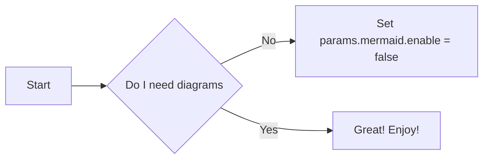

By default, a site using Docsy has the theme's default fonts, colors, and general look and feel. However, if you want your own color scheme (and you probably will!) you can very easily override the theme defaults with your own project-specific values - Hugo will look in your project files first when looking for information to build your site. Also because Docsy uses Bootstrap 4 and SCSS for styling, you can override just single values in its special SCSS project variables file, or do more serious customization by creating your own versions of entire SCSS files.

## Color palette and other styles 

To quickly change your site's colors, add SCSS variable project overrides to `assets/scss/_variables_project.scss`. A simple example changing the primary and secondary color to two shades of purple:

```scss
$primary: #390040;
$secondary: #A23B72;
```

* See `assets/scss/_variables.scss` in the theme for color variables etc. that can be set to change the look and feel.
* Also see available variables in Bootstrap 4: https://getbootstrap.com/docs/4.0/getting-started/theming/ and https://github.com/twbs/bootstrap/blob/v4-dev/scss/_variables.scss

The theme has features such as rounded corners and gradient backgrounds enabled by default. These can also be toggled in your project variables file:

```scss
$enable-gradients: true;
$enable-rounded: true;
$enable-shadows: true;
```

{}
PostCSS (autoprefixing of CSS browser-prefixes) is not enabled when running in server mode (it is a little slow), so Chrome is the recommended choice for development.
{}

Also note that any SCSS import will try the project before the theme, so you can -- as one example -- create your own `_assets/scss/_content.scss` and get full control over how your Markdown content is styled.

## Fonts

The theme uses [Open Sans](https://fonts.google.com/specimen/Open+Sans) as its primary font. To disable Google Fonts and use a system font, set this SCSS variable in `assets/scss/_variables_project.scss`:

```scss
$td-enable-google-fonts: false;
```

To configure another Google Font:

```scss
$google_font_name: "Open Sans";
$google_font_family: "Open+Sans:300,300i,400,400i,700,700i";
```

Note that if you decide to go with a font with different weights (in the built-in configuration this is `300` (light), `400` (medium) and `700` (bold)), you also need to adjust the weight related variables, i.e. variables starting with `$font-weight-`.

## CSS utilities

For documentation of available CSS utility classes, see the [Bootstrap Documentation](https://getbootstrap.com/). This theme adds very little on its own in this area. However, we have added some color state CSS classes that can be useful in a dynamic context:

* `.-bg-<color>`
* `.-text-<color>`

You can use these classes, for example, to style your text in an appropriate color when you don't know if the `primary` color is dark or light, to ensure proper color contrast. They are also useful when you receive the color code as a [shortcode](/docs/adding-content/shortcodes/) parameter.

The value of `<color>` can be any of the color names, `primary`, `white`, `dark`, `warning`, `light`, `success`, `300`, `blue`, `orange` etc.

When you use `.-bg-<color>`, the text colors will be adjusted to get proper contrast:

```html
<div class="-bg-primary p-3 display-4">Background: Primary</div>
<div class="-bg-200 p-3 display-4">Background: Gray 200</div>
```

<div class="-bg-primary p-3 display-4 w-75">Background: Primary</div>
<div class="-bg-200 p-3 display-4 mb-5 w-50 w-75">Background: Gray 200</div>

`.-text-<color>` sets the text color only:

```html
<div class="-text-blue pt-3 display-4">Text: Blue</div>
```

<div class="-text-blue pt-3 display-4">Text: Blue</div>

## Code highlighting with Chroma

With Hugo version 0.60 and higher, you can choose from a range of code block highlight and colour styles using [Chroma](https://github.com/alecthomas/chroma) that are applied to your fenced code blocks by default. If you copied a recent `config.toml` your site uses Tango (like this site), otherwise the Hugo default is Monokai. You can switch to any of the [available Chroma styles](https://xyproto.github.io/splash/docs/all.html) (including our Docsy default Tango) using your `config.toml`:

```toml
[markup]
  [markup.goldmark]
    [markup.goldmark.renderer]
      unsafe = true
  [markup.highlight]
      # See a complete list of available styles at https://xyproto.github.io/splash/docs/all.html
      style = "tango"
 ```

By default code highlighting styles are not applied to code blocks without a specified language, instead you get Docsy's default style of grey with black text. If you would like the code highlighting style to apply to all code blocks, even without a language, uncomment or add the following line under `[markup.highlight]` in your `config.toml`.

```toml
# Uncomment if you want your chosen highlight style used for code blocks without a specified language
guessSyntax = "true"
```

You can find out more about code highlighting in Hugo with Chroma in [Syntax Highlighting](https://gohugo.io/content-management/syntax-highlighting/).

## Code highlighting with Prism

Optionally, you can enable Prism syntax highlighting in your `config.toml`:

```toml
# Enable syntax highlighting and copy buttons on code blocks with Prism
prism_syntax_highlighting = true
```

When this option is enabled your site uses [Prism](https://prismjs.com/index.html) instead of Chroma for code block highlighting.

Prism is a popular open source syntax highlighter which supports over 200 [languages](https://prismjs.com/index.html#supported-languages) and various [plugins](https://prismjs.com/index.html#plugins).

Docsy includes JavaScript and CSS files for a basic Prism configuration, which supports:

* Code blocks styled with the Prism `Default` theme
* Copy to clipboard buttons on code blocks
* Syntax highlighting for a number of common languages, as specified in the following Prism download link:

```none
    https://prismjs.com/download.html#themes=prism&languages=markup+css+clike+javascript+bash+c+csharp+cpp+go+java+markdown+python+scss+sql+toml+yaml&plugins=toolbar+copy-to-clipboard    
```

### Code blocks with no language

By default Prism code highlighting styles are not applied to code blocks without a specified language, instead you get Docsy's default style of grey with black text. To apply Prism styling to code blocks with no language or a language not supported by Prism, specify `none` as the language after your triple backticks.

### Extending Prism for additional languages or plugins

If the included Prism configuration is not sufficient for your requirements, and you want to use additional languages or plugins you can replace the included files with your own.

1. Download your own Prism JS and CSS files from <https://prismjs.com/download.html>
2. Replace the included Prism JS and CSS with the files you downloaded:
    * Copy the Javascript file to `static/js/prism.js`
    * Copy the CSS file to `static/css/prism.css`

## \\(\LaTeX\\) support with \\(\KaTeX\\)

[\\(\LaTeX\\)](https://www.latex-project.org/) is a high-quality typesetting system for the production of technical and scientific documentation. Due to its excellent math typesetting capabilities, \\(\TeX\\) became the de facto standard for the communication and publication of scientific documents, especially if these documents contain a lot of mathematical formulae. Designed and mostly written by Donald Knuth, the initial version was released in 1978. Dating back that far, \\(\LaTeX\\) has `pdf` as its primary output target and is not particularly well suited for producing HTML output for the Web. Fortunately, with [\\(\KaTeX\\)](https://katex.org/) there exists a fast and easy-to-use JavaScript library for \\(\TeX\\) math rendering on the web, which was integrated into the Docsy theme.

With \\(\KaTeX\\) support enabled in Docsy, you can include complex mathematical formulae into your web page, either inline or centred on its own line. Since \\(\KaTeX\\) relies on server side rendering, it produces the same output regardless of your browser or your environment. Formulae can be shown either inline or in display mode:

### Inline formulae

The following code sample produces a text line with three inline formulae:

```tex
When \\(a \ne 0\\), there are two solutions to \\(ax2 + bx + c= 0\\) and they are \\(x = {-b \pm \sqrt{b^2-4ac} \over 2a}.\\)
```

When \\(a \ne 0\\), there are two solutions to \\(ax2 + bx + c= 0\\) and they are \\(x = {-b \pm \sqrt{b^2-4ac} \over 2a}.\\)

### Formulae in display mode

The following code sample produces an introductory text line followed by a formula numbered as `(1)` residing on her own line:

```tex
The probability of getting \\(k\\) heads when flipping \\(n\\) coins is:
$$\tag*{(1)} P(E) = {n \choose k} p^k (1-p)^{n-k}$$
```

The probability of getting \\(k\\) heads when flipping \\(n\\) coins is:
$$\tag*{(1)}  P(E) = {n \choose k} p^k (1-p)^{n-k}$$

{}
This [wiki page](https://en.wikibooks.org/wiki/LaTeX/Mathematics) provides in-depth information about typesetting mathematical formulae using the \\(\LaTeX\\) typesetting system.
{}

### Enabling and configuring \\(\LaTeX\\) support

To enable/disable \\(\KaTeX\\) support inside the Docsy theme, update `config.toml`:

```toml
[params.katex]
enable = true
```

Additionally, you can customize various \\(\KaTeX\\) options inside `config.toml`, if needed:

```toml
[params.katex]
# enable/disable KaTeX support
enable = true
# Element(s) scanned by auto render extension. Default: document.body
html_dom_element = "document.body"

[params.katex.options]
# If true (the default), KaTeX will throw a ParseError when it encounters an
# unsupported command or invalid LaTeX. If false, KaTeX will render unsupported
# commands as text, and render invalid LaTeX as its source code with hover text
# giving the error, in the color given by errorColor.
throwOnError = false
errorColor = "#CD5C5C"

# This is a list of delimiters to look for math, processed in the same order as
# the list. Each delimiter has three properties:
#   left:    A string which starts the math expression (i.e. the left delimiter).
#   right:   A string which ends the math expression (i.e. the right delimiter).
#   display: Whether math in the expression should be rendered in display mode.
[[params.katex.options.delimiters]]
  left = "$$"
  right = "$$"
  display = true
[[params.katex.options.delimiters]]
  left = "$"
  right = "$"
  display = false
[[params.katex.options.delimiters]]
  left = "\\("
  right = "\\)"
  display = false
[[params.katex.options.delimiters]]
  left = "\\["
  right = '\\]'
  display = true
```

For a complete list of options and their detailed description, have a look at the documentation of \\({\KaTeX}'s\\) [Rendering API options](https://katex.org/docs/autorender.html#api) and of \\({\KaTeX}'s\\) [configuration options](https://katex.org/docs/options.html).

### Display of Chemical Equations and Physical Units

[mhchem](https://www.ctan.org/pkg/mhchem) is a \\(\LaTeX\\) package for typesetting chemical molecular formulae and equations. Fortunately, \\(\KaTeX\\) provides the `mhchem` [extension](https://github.com/KaTeX/KaTeX/tree/master/contrib/mhchem) that makes the `mhchem` package accessible when authoring content for the web. Since this extension was integrated into the Docsy theme, you can write beautiful chemical equations easily once `mhchem` support is enabled inside your `config.toml`:

```toml
[params.katex]
enable = true

[params.katex.mhchem]
enable = true
```

With `mhchem` extension enabled, you can easily include chemical equations into your page. The equations can be shown either inline or can reside on its own line. The following code sample produces a text line including a chemical equation:

```mhchem
*Precipitation of barium sulfate:* \\(\ce{SO4^2- + Ba^2+ -> BaSO4 v}\\)
```

*Precipitation of barium sulfate:* \\(\ce{SO4^2- + Ba^2+ -> BaSO4 v}\\)

More complex equations, like the one shown in the code sample below, should be displayed on their own line:

```mhchem
$$\tag*{(2)} \ce{Zn^2+  <=>[+ 2OH-][+ 2H+]  $\underset{\text{amphoteric hydroxide}}{\ce{Zn(OH)2 v}}$  <=>[+ 2OH-][+ 2H+]  $\underset{\text{tetrahydroxozincate}}{\ce{[Zn(OH)4]^2-}}$}$$
```

$$\tag*{(2)} \ce{Zn^2+  <=>[+ 2OH-][+ 2H+]  $\underset{\text{amphoteric hydroxide}}{\ce{Zn(OH)2 v}}$  <=>[+ 2OH-][+ 2H+]  $\underset{\text{tetrahydroxozincate}}{\ce{[Zn(OH)4]^2-}}$}$$

{}
The [manual](https://mhchem.github.io/MathJax-mhchem/) for mchem’s input syntax provides in-depth information about typesetting chemical formulae and physical units using the `mhchem` tool.
{}

Use of `mhchem` is not limited to the authoring of chemical equations, using the included `\pu` command, pretty looking physical units can be written with ease, too. The following code sample produces two text lines with four numbers plus their corresponding physical units:

```mhchem
* Scientific number notation: \\(\pu{1.2e3 kJ}\\) or \\(\pu{1.2E3 kJ}\\) \\
* Divisions: \\(\pu{123 kJ/mol}\\) or \\(\pu{123 kJ//mol}\\)
```

* Scientific number notation: \\(\pu{1.2e3 kJ}\\) or \\(\pu{1.2E3 kJ}\\)
* Divisions: \\(\pu{123 kJ/mol}\\) or \\(\pu{123 kJ//mol}\\)

For a complete list of options when authoring physical units, have a look at the [section](https://mhchem.github.io/MathJax-mhchem/#pu) on physical units in the `mhchem` documentation.

## Diagrams with Mermaid

[Mermaid](https://mermaid-js.github.io) is a Javascript library for rendering simple text definitions to useful diagrams in the browser.  It can generate a variety of different diagram types, including flowcharts, sequence diagrams, class diagrams, state diagrams, ER diagrams, user journey diagrams, Gantt charts and pie charts.

With Mermaid support enabled in Docsy, you can include the text definition of a Mermaid diagram inside a code block, and it will automatically be rendered by the browser as soon as the page loads.

The great advantage of this is anyone who can edit the page can now edit the diagram - no more hunting for the original tools and version to make a new edit.

For example, the following defines a simple flowchart:

````

````

Automatically renders to:


To enable/disable Mermaid, update `config.toml`:

```toml
[params.mermaid]
enable = true
```

You also need to disable the `guessSyntax` from markup highlighting in `config.toml`  for Mermaid to work:

```toml
[markup]
  [markup.highlight]
      guessSyntax = "false"
```

You can also update settings for Mermaid, such as themes, padding, etc:

```toml
[params.mermaid]
enable = true
theme = "neutral"

[params.mermaid.flowchart]
diagramPadding = 6
```

See the [Mermaid documentation](https://mermaid-js.github.io/mermaid/#/Setup?id=mermaidapi-configuration-defaults) for a list of defaults that can be overridden.

Settings can also be overridden on a per-diagram basis by making use of the `%%init%%` header at the start of the diagram definition.  See the [Mermaid theming documentation](https://mermaid-js.github.io/mermaid/#/theming?id=themes-at-the-local-or-current-level).

## UML Diagrams with PlantUML

[PlantUML](https://plantuml.com/en/) is an alternative to Mermaid that lets you quickly create UML diagrams, including sequence diagrams, use case diagrams, and state diagrams. Unlike Mermaid diagrams, which are entirely rendered in the browser, PlantUML uses a PlantUML server to create diagrams. You can use the provided default demo server (not recommended for production use), or run a server yourself. PlantUML offers a wider range of image types than Mermaid, so may be a better choice for some use cases.

Diagrams are defined using a simple and intuitive language. ([see PlantUML Language Reference Guide](https://plantuml.com/en/guide)).

The following example shows a use case diagram:

````
```plantuml
participant participant as Foo
actor       actor       as Foo1
boundary    boundary    as Foo2
control     control     as Foo3
entity      entity      as Foo4
database    database    as Foo5
collections collections as Foo6
queue       queue       as Foo7
Foo -> Foo1 : To actor 
Foo -> Foo2 : To boundary
Foo -> Foo3 : To control
Foo -> Foo4 : To entity
Foo -> Foo5 : To database
Foo -> Foo6 : To collections
Foo -> Foo7: To queue
```
````

Automatically renders to:

```plantuml
participant participant as Foo
actor       actor       as Foo1
boundary    boundary    as Foo2
control     control     as Foo3
entity      entity      as Foo4
database    database    as Foo5
collections collections as Foo6
queue       queue       as Foo7
Foo -> Foo1 : To actor 
Foo -> Foo2 : To boundary
Foo -> Foo3 : To control
Foo -> Foo4 : To entity
Foo -> Foo5 : To database
Foo -> Foo6 : To collections
Foo -> Foo7: To queue
```

To enable/disable PlantUML, update `config.toml`:

```
[params.plantuml]
enable = true
```

Other optional settings are:
```
[params.plantuml]
enable = true
theme = "default"

#Set url to plantuml server 
#default is http://www.plantuml.com/plantuml/svg/
svg_image_url = "https://www.plantuml.com/plantuml/svg/"

```

## MindMap support with MarkMap

[MarkMap](https://markmap.js.org/) is a Javascript library for rendering simple text definitions to MindMap in the browser.

For example, the following defines a simple MindMap:

````
```markmap
# markmap

## Links

- <https://markmap.js.org/>
- [GitHub](https://github.com/gera2ld/markmap)

## Related

- [coc-markmap](https://github.com/gera2ld/coc-markmap)
- [gatsby-remark-markmap](https://github.com/gera2ld/gatsby-remark-markmap)

## Features

- links
- **inline** ~~text~~ *styles*
- multiline
  text
- `inline code`
-
    ```js
    console.log('code block');
    ```
- Katex - $x = {-b \pm \sqrt{b^2-4ac} \over 2a}$
```
````

Automatically renders to:

```markmap
# markmap

## Links

- <https://markmap.js.org/>
- [GitHub](https://github.com/gera2ld/markmap)

## Related

- [coc-markmap](https://github.com/gera2ld/coc-markmap)
- [gatsby-remark-markmap](https://github.com/gera2ld/gatsby-remark-markmap)

## Features

- links
- **inline** ~~text~~ *styles*
- multiline
  text
- `inline code`
-
    ```js
    console.log('code block');
    ```
- Katex - $x = {-b \pm \sqrt{b^2-4ac} \over 2a}$
```

To enable/disable MarkMap, update `config.toml`:

```toml
[params.markmap]
enable = true
```

## Customizing templates

### Add code to head or before body end

If you need to add some code (CSS import, cookie consent, or similar) to the `head` section on every page, add the `head-end.html` partial to your project:

```
layouts/partials/hooks/head-end.html
```

And add the code you need in that file. Your partial code is automatically included just before the end of the theme partial [`head.html`](https://github.com/google/docsy/blob/master/layouts/partials/head.html). The theme version of [`head-end.html`](https://github.com/google/docsy/blob/master/layouts/partials/hooks/head-end.html) is empty.


Similarly, if you want to add some code right before the `body` end, create your own version of the following file:

```
layouts/partials/hooks/body-end.html
```

Any code in this file is included automatically at the end of the theme partial [`scripts.html`](https://github.com/google/docsy/blob/master/layouts/partials/head.html).

Both `head.html` and `scripts.html` are then used to build Docsy's [base page layout](https://github.com/google/docsy/blob/master/layouts/_default/baseof.html), which is used by all the other page templates:

```html
<!doctype html>
<html lang="{{ .Site.Language.Lang }}" class="no-js">
  <head>
    {{ partial "head.html" . }}
  </head>
  <body class="td-{{ .Kind }}">
    <header>
      {{ partial "navbar.html" . }}
    </header>
    <div class="container-fluid td-default td-outer">
      <main role="main" class="td-main">
        {{ block "main" . }}{{ end }}
      </main>
      {{ partial "footer.html" . }}
    </div>
    {{ partialCached "scripts.html" . }}
  </body>
</html>
```

